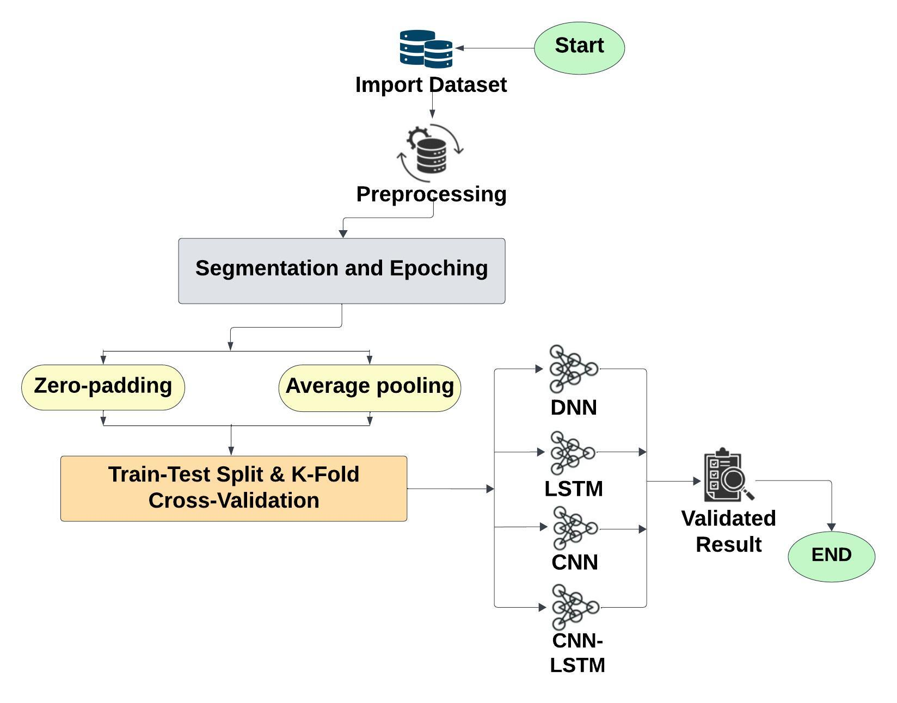
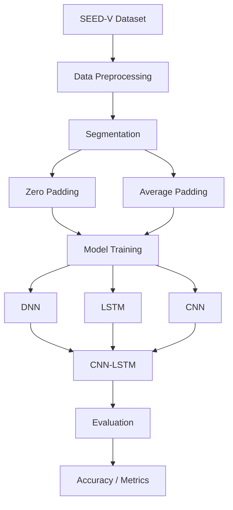

<div align="center">


# 🧠 Deep Learning for Emotion Recognition

**A comparative study of deep learning architectures and padding strategies for emotion recognition using the SEED-V dataset.**
<br>


<br>


</div>

---

## 📌 Overview

This project investigates the use of **deep learning techniques for emotion recognition** using the **SEED-V dataset**.

The study compares four different neural-network architectures:

- 🧠 **DNN — Deep Neural Network**
- 🔄 **LSTM — Long Short-Term Memory**
- 🧩 **CNN — Convolutional Neural Network**
- 🔗 **CNN-LSTM — Hybrid CNN + LSTM**

In addition to model architecture, the project investigates the effect of different sequence-padding techniques:

- ⬛ **Zero Padding**
- 🟦 **Average Padding**

The reported experiments achieved accuracies ranging from **68% to 83%**, with the **CNN-LSTM model achieving the highest reported accuracy of 83%**.

---

# 🎯 Project Objectives

The main objectives of this research are:

1. Compare different deep learning architectures for emotion recognition.
2. Investigate the effect of padding techniques on model performance.
3. Analyze the ability of CNNs to capture local features.
4. Investigate LSTM-based temporal modeling.
5. Evaluate a hybrid CNN-LSTM architecture.
6. Analyze classification errors using confusion matrices.
7. Identify promising directions for future emotion-recognition research.

---

# 😊 Emotion Classes

The project uses five emotion categories from the SEED-V dataset:

| Emotion | Description |
|:---:|---|
| 😄 **Happy** | Positive emotional state |
| 😨 **Fear** | Fear-related emotional state |
| 😐 **Neutral** | Neutral emotional state |
| 😢 **Sad** | Sadness-related emotional state |
| 🤢 **Disgust** | Disgust-related emotional state |

---

# 📚 Dataset

This project utilizes the **SEED-V dataset** for emotion-recognition experiments.

SEED-V is an EEG-based emotion-recognition dataset developed by the Brain-Computer Interface & Machine Learning Laboratory at Shanghai Jiao Tong University.

More information about the dataset is available through the **BCMI@SJTU SEED project page**.

### Dataset Processing Pipeline

```text
                 ┌─────────────────────┐
                 │     SEED-V Dataset  │
                 └──────────┬──────────┘
                            │
                            ▼
                 ┌─────────────────────┐
                 │   Preprocessing     │
                 │   & Segmentation    │
                 └──────────┬──────────┘
                            │
                 ┌──────────┴──────────┐
                 │                     │
                 ▼                     ▼
          Zero Padding          Average Padding
                 │                     │
                 └──────────┬──────────┘
                            │
                            ▼
                  Model Experiments
                            │
                            ▼
                       Evaluation
```
# 🏗️ Experiment Architecture


The experimental pipeline consists of three main stages:

1. **1️⃣ Data Preparation**: The SEED-V data is processed and segmented before being supplied to the neural networks.
2. **2️⃣ Model Experiments**: Multiple architectures are trained/evaluated with different padding configurations.
3. **3️⃣ Evaluation**: The trained models are evaluated and their performance metrics are collected for comparison.

---

## 🧠 Deep Learning Models

### 1. DNN — Deep Neural Network
The Deep Neural Network acts as a baseline architecture.

```text
Input
  │
  ▼
Dense Layer
  │
  ▼
Activation
  │
  ▼
Dense Layer
  │
  ▼
Output
```

DNNs use fully connected layers to learn nonlinear relationships between input features and emotion classes.

> **Reported Accuracy:** `68%`

---

### 2. LSTM — Long Short-Term Memory
LSTM is a recurrent neural-network architecture designed to learn dependencies in sequential data.

```text
Input Sequence
      │
      ▼
 ┌──────────┐
 │   LSTM   │
 └────┬─────┘
      │
      ▼
Temporal Features
      │
      ▼
Classifier
      │
      ▼
Emotion
```

LSTM is particularly useful when the ordering of observations contains meaningful information.

> **Reported Accuracy:** `74%`

---

### 3. CNN — Convolutional Neural Network
CNNs are designed to learn local patterns through convolution operations.

```text
Input
  │
  ▼
Convolution
  │
  ▼
Activation
  │
  ▼
Pooling
  │
  ▼
Feature Extraction
  │
  ▼
Classifier
  │
  ▼
Emotion
```

The reported results indicate that CNN-based feature extraction performed strongly in this experiment.

> **Reported Accuracy:** `81%`

---

### 4. CNN-LSTM — Hybrid Model
The CNN-LSTM combines convolutional feature extraction with recurrent temporal modeling.

```text
              Input
                │
                ▼
               CNN
                │
                ▼
        Local Feature Extraction
                │
                ▼
              LSTM
                │
                ▼
        Temporal Representation
                │
                ▼
            Classifier
                │
                ▼
             Emotion
```

This architecture attempts to combine the feature-learning capability of CNNs with the sequential modeling capability of LSTMs.

> **Reported Accuracy:** `83%`

---

## 📊 Summary of Model Performance

| Model Architecture | Description | Reported Accuracy |
| :--- | :--- | :---: |
| **DNN** | Baseline fully-connected network | `68%` |
| **LSTM** | Recurrent neural network for temporal data | `74%` |
| **CNN** | Local pattern extraction through convolution | `81%` |
| **CNN-LSTM** | Hybrid feature extraction & sequence modeling | **`83%`** |

---

## 🧩 Padding Techniques

A major component of this project is the comparison of two padding strategies.

### ⬛ Zero Padding
Zero padding extends a sequence by inserting zeros until all sequences reach the required length.

**Example:**
* **Original:** `[0.42, 0.61, 0.73]`
* **After Zero Padding:** `[0.42, 0.61, 0.73, 0, 0, 0]`

#### Advantages
- Simple and easy to implement
- Computationally inexpensive
- Commonly used for sequence normalization

#### Potential Limitation
If a large amount of padding is introduced, zero values may differ significantly from the original data distribution.

## 🟦 Average Padding

Average padding uses the average value of the existing sequence to fill missing positions.

**Example:**

- **Original:** `[0.42, 0.61, 0.73]`
- **Average:** `0.586`
- **After Average Padding:** `[0.42, 0.61, 0.73, 0.586, 0.586, 0.586]`

This can make the padding values more similar to the existing data distribution.

> **Note:** The effectiveness of a padding strategy is dataset- and preprocessing-dependent. The observations in this repository should not be interpreted as a universal result for every EEG dataset.

---

## 🔬 Experimental Configurations

The following experimental configurations were evaluated:

| Experiment | Architecture | Padding |
| :--- | :--- | :--- |
| **1** | DNN | Zero Padding |
| **2** | DNN | Average Padding |
| **3** | LSTM | Zero Padding |
| **4** | LSTM | Average Padding |
| **5** | CNN | Zero Padding |
| **6** | CNN | Average Padding |
| **7** | CNN-LSTM | Average Padding |

---

## 📊 Results

The reported model accuracies are:

| Model | Accuracy |
| :--- | :---: |
| 🧠 **DNN** | 68% |
| 🔄 **LSTM** | 74% |
| 🧩 **CNN** | 81% |
| 🔗 **CNN-LSTM** | 83% |

### 🏆 Reported Best Result
The **CNN-LSTM** configuration achieved the highest reported accuracy of **83%** among the experiments described in this project.

---

## 📈 Accuracy Visualization

*(Place accuracy visualization image or chart here)*

---

## 🔍 Analysis of Results

* **🧠 DNN — 68%**  
  The DNN provides a useful baseline but does not explicitly model spatial or temporal structure.

* **🔄 LSTM — 74%**  
  The LSTM improves upon the DNN by modeling sequential dependencies.

* **🧩 CNN — 81%**  
  The CNN achieves a substantially higher reported accuracy, suggesting that local feature extraction is useful for the representation used in these experiments.

* **🔗 CNN-LSTM — 83%**  
  The hybrid CNN-LSTM achieves the highest reported accuracy. One possible explanation is that the CNN first extracts useful local representations and the LSTM subsequently models their sequential relationships.

---

## 🧩 Padding Analysis

The reported experiments indicate that average padding performed particularly well with CNN-based architectures.

The project reports:
* **CNN** → 81%
* **CNN-LSTM** → 83%
* **LSTM (Zero Padding)** → 74%

This suggests that padding strategy can interact with model architecture.

However, to isolate the effect of padding more rigorously, every architecture should ideally be evaluated under both padding strategies using exactly the same:
* Dataset split
* Preprocessing
* Training epochs
* Optimizer
* Learning rate
* Batch size
* Evaluation set

---

## 🎯 Confusion Analysis

The reported confusion-matrix analysis indicates that the models had difficulty distinguishing between:

$$\text{Fear} \leftrightarrow \text{Sad}$$

These classes may contain overlapping representations under the current experimental setup.

### Potential Areas for Further Analysis:
* Per-class accuracy
* Precision, Recall, and F1-score
* Detailed Confusion Matrices
* Feature Distributions
* Subject-specific performance

## 📐 Evaluation Metrics

### Accuracy
Accuracy measures the proportion of correctly classified samples:

$$\text{Accuracy} = \frac{\text{Correct Predictions}}{\text{Total Predictions}}$$

An equivalent mathematical representation is:

$$\text{Accuracy} = \frac{\sum_{i=1}^{N} \mathbb{I}(y_i = \hat{y}_i)}{N}$$

**Where:**
* $y_i$ = true label
* $\hat{y}_i$ = predicted label
* $N$ = total number of samples
* $\mathbb{I}(\cdot)$ = indicator function

---

### Precision

$$\text{Precision} = \frac{TP}{TP + FP}$$

Precision measures how many samples predicted as a particular class were actually members of that class.

---

### Recall

$$\text{Recall} = \frac{TP}{TP + FN}$$

Recall measures how many samples belonging to a class were successfully detected.

---

### F1-Score

$$\text{F1} = 2 \times \frac{\text{Precision} \times \text{Recall}}{\text{Precision} + \text{Recall}}$$

F1-score provides a balance between precision and recall.

---

## 🧪 Experimental Pipeline



<details>
<summary><b>View ASCII Diagram</b></summary>

```text
                 SEED-V Dataset
                       │
                       ▼
              Data Preprocessing
                       │
                       ▼
                 Segmentation
                       │
                       ▼
             ┌─────────┴─────────┐
             │                   │
             ▼                   ▼
       Zero Padding       Average Padding
             │                   │
             └─────────┬─────────┘
                       │
                       ▼
              ┌────────────────┐
              │ Model Training │
              └───────┬────────┘
                      │
       ┌──────────────┼───────────────┐
       │              │               │
       ▼              ▼               ▼
      DNN            LSTM            CNN
       │              │               │
       └──────────────┼───────────────┘
                      │
                      ▼
                  CNN-LSTM
                      │
                      ▼
                 Evaluation
                      │
                      ▼
              Accuracy / Metrics
```
</details>

## 🛠️ Technology Stack

<p align="center">
  
  
  
  
  
  
  
  
</p>

---

## 📦 Requirements

The project relies on the following core dependencies:

- `numpy`
- `pandas`
- `scikit-learn`
- `tensorflow`
- `keras`
- `matplotlib`
- `seaborn`

Install the dependencies with:

```bash
pip install -r requirements.txt
```

If the `requirements.txt` file does not exist, you can generate it using:

```bash
pip freeze > requirements.txt
```

---

## 🚀 Installation

### 1. Clone the Repository

```bash
git clone <YOUR_REPOSITORY_URL>
cd <YOUR_REPOSITORY_NAME>
```

### 2. Create a Virtual Environment

**Windows:**
```cmd
python -m venv venv
venv\Scripts\activate
```

**Linux / macOS:**
```bash
python3 -m venv venv
source venv/bin/activate
```

### 3. Install Dependencies

```bash
pip install -r requirements.txt
```

---

## ▶️ Running the Experiments

If the project uses Jupyter notebooks, start the server with:

```bash
jupyter notebook
```

*or*

```bash
jupyter lab
```

Then run the individual model experiments.

---

## 🔄 Experiment Workflow

```text
Load Data
   ↓
Preprocess
   ↓
Segment
   ↓
Apply Padding
   ↓
Build Model
   ↓
Train
   ↓
Validate
   ↓
Evaluate
   ↓
Save Results
```
# Deep Learning Emotion Recognition

[](LICENSE)
[](https://www.python.org/)
[](https://www.tensorflow.org/)

A deep learning project focused on EEG-based emotion recognition using various neural network architectures.

---

## 📂 Repository Structure

```text
Deep-Learning-Emotion-Recognition/
│
├── 📂 figures/
│   ├── diagram.jpeg
│   └── diagram_metrics.png
│
├── 📂 notebooks/
│   ├── DNN.ipynb
│   ├── LSTM.ipynb
│   ├── CNN.ipynb
│   └── CNN_LSTM.ipynb
│
├── 📂 src/
│   ├── preprocessing.py
│   ├── models.py
│   ├── train.py
│   └── evaluate.py
│
├── 📄 requirements.txt
├── 📄 README.md
└── 📄 LICENSE
```

> **Note:** Please adjust the directory tree above to match any additional local files or updates to your repository.

---

## 🔁 Reproducibility

To ensure reproducible experimental results, set fixed random seeds at the beginning of your scripts:

```python
import random
import numpy as np
import tensorflow as tf

SEED = 42
random.seed(SEED)
np.random.seed(SEED)
tf.random.set_seed(SEED)
```

### Experiment Parameters Checklist
For rigorous experiment tracking, ensure the following parameters are logged:

- **Dataset split**
- **Number of epochs**
- **Batch size**
- **Learning rate**
- **Optimizer**
- **Loss function**
- **Padding strategy**
- **Input shape**
- **Random seed**
- **Hardware/GPU information**

---

## 📊 Recommended Evaluation

Future experiments should report a comprehensive suite of metrics beyond standard accuracy:

### Classification Metrics
* Accuracy
* Precision
* Recall
* F1-score (Macro & Weighted)

### Visualizations
* Confusion Matrix
* Training vs. Validation Accuracy
* Training vs. Validation Loss

### Research Evaluation
For EEG emotion recognition, **subject-independent evaluation** (e.g., Leave-One-Subject-Out cross-validation) is recommended to assess model generalization across previously unseen participants.

---

## 🔮 Future Work

### 🤖 Advanced Architectures
Explore more complex temporal and spatial models:
- Transformer architectures
- GRU & Bidirectional LSTM (BiLSTM)
- Hybrid CNN-BiLSTM networks
- Temporal Convolutional Networks (TCN)
- Attention mechanisms
- Specialized EEG deep-learning frameworks

### 📈 Hyperparameter Optimization
Investigate hyperparameters including learning rate, batch size, network depth, neuron/filter counts, dropout rates, kernel sizes, and optimizers.
* **Potential Methods:** Grid Search, Random Search, Bayesian Optimization, and Hyperband.

### 🧩 Data Augmentation
Apply time-series and EEG-specific augmentation techniques (ensuring emotional state validity is preserved):
- Noise injection
- Temporal shifting & scaling
- Window sampling
- Channel perturbation

### 🧠 Explainable AI (XAI)
Incorporate interpretability methods to understand feature importance and neurophysiological relevance:
- SHAP (SHapley Additive exPlanations)
- Integrated Gradients & Saliency Analysis
- Attention map visualizations

### 🌍 Multimodal Emotion Recognition
Extend the system to fuse multiple physiological and behavioral signals:

```text
              ┌─────────────┐
              │     EEG     │
              └──────┬──────┘
                     │
                     ▼
               EEG Features
                     │
                     │
 ┌─────────────┐     │     ┌─────────────┐
 │ Facial      │─────┼─────│ Speech      │
 │ Expression  │     │     │ Features    │
 └─────────────┘     │     └─────────────┘
                     │
                     ▼
              Feature Fusion
                     │
                     ▼
            Emotion Prediction
```

---

## ⚠️ Limitations

When interpreting results, keep the following constraints in mind:
- **Individual Variability:** EEG signals are highly subject-dependent; performance may vary significantly across participants.
- **Dataset Constraints:** Dataset size, diversity, and recording environments influence generalizability.
- **Preprocessing Impact:** Sequence padding strategies can affect feature representation.
- **Class Discrimination:** Certain subtle emotional states (e.g., *Fear* vs. *Sad*) can be difficult to distinguish under standard setups.
- **Scope:** This project is designed purely for research and academic exploration, **not** as a clinically validated diagnostic tool.

---

## 🔐 Ethics, Bias & Privacy

Using physiological data for emotion recognition requires strict ethical safeguards:
- **Privacy & Consent:** Secure handling of sensitive physiological recordings and clear participant consent.
- **Fairness:** Evaluation across diverse demographics and cross-subject fairness analysis.
- **Transparency:** Clear communication regarding system capabilities, explainability, and potential misuse.

---

## 🤝 Contributing

Contributions are welcome! Please follow these steps to contribute:

1. **Fork** the repository
2. **Create** a feature branch:
   ```bash
   git checkout -b feature/your-feature
   ```
3. **Commit** your changes:
   ```bash
   git add .
   git commit -m "Add your feature"
   ```
4. **Push** to the branch:
   ```bash
   git push origin feature/your-feature
   ```
5. **Open a Pull Request**

*Please include a clear description of changes, motivation, experimental setup, test results, and hardware context in your Pull Request.*

---


## 🙏 Acknowledgments

* 🧠 **SEED-V / BCMI@SJTU** dataset and research group
* 🐍 Python Scientific Computing Ecosystem
* 🧠 TensorFlow & Keras
* 📊 Scikit-learn, Matplotlib, and Seaborn
* The broader open-source deep learning and neuroinformatics communities

## 👨‍💻 Author

<p align="center">
  <strong>MD Sifat Ahammed Akash</strong>
</p>
<p align="center">
  Full-Stack Developer • React Developer • AI/ML Enthusiast
</p>
<p align="center">
  <a href="mailto:sifatahammed821@gmail.com">
    
  </a>
  <a href="https://github.com/sifatahammed">
    
  </a>
</p>


## 📄 License

<div align="center">

MIT License © MD Sifat Ahammed Akash
</div>
<div align="center">
⭐ If this project is useful for your research or coursework, consider giving the repository a star!

Built with ❤️ using Python, TensorFlow, OpenCV, and Keras.

 </div>
